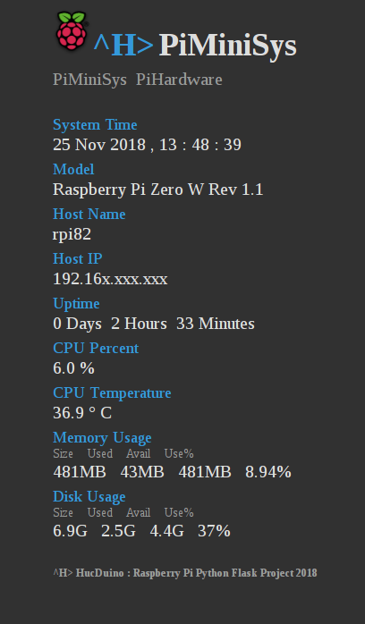

# PiMiniSys
Raspberry Pi mini system and hardware info on Python Flask dashboard

* tested on Raspberry Pi Model B, Zero W, 3 Model A Plus and 3 Model B Plus. 

## Getting started: ##
* **piminisys.py** is our servlet, which runs using Flask (http://flask.pocoo.org/). (Requirements) Install it by running: 

* `sudo pip install Flask`
* `sudo pip install psutil`
* `sudo pip install git+https://github.com/nicmcd/vcgencmd.git`

## Starting the servlet: ##
* change to the **piminisys** directory
* chmod piminisys.py to 777
* edit you own settings in piminisys.py
* start the Flask sever from the command line:

  `sudo python piminisys.py`
  
## Accessing the Dashboard: ##
* Since the servlet is running locally, you can access the dashboard by navigating to **http://[you ip]:5000** through your web browser,

## useful links: ##
*  http://flask.pocoo.org/
*  https://github.com/giampaolo/psutil
*  https://github.com/nicmcd/vcgencmd
